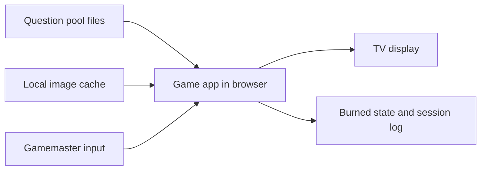

# 01 — Architecture

**Status:** implemented

## Approach (D-3, D-4, D-5; file layout: D-35, `19-repo-layout.md`)
A web app opened in a browser in fullscreen on the TV-connected machine, served by a **tiny local server** (agreed, D-3). Question content comes from local JSON/YAML files. Game state (burned, session log, current game) is persisted by the server in SQLite (D-4). The server is Python (D-4).

## Decisions needed
- ~~Frontend~~ Svelte 5 + Vite + TypeScript, built to static files served by the Python server (D-5).
- ~~Persistence: JSON file through a small local server vs. browser localStorage vs. a git-tracked file.~~ Local server agreed (D-3). Storage: SQLite for state, a JSON file for questions (D-4).
- ~~Server language~~ Python (D-4).
- ~~One screen vs. two (a TV view plus a separate gamemaster view).~~ One screen, no GM view (D-30).

## Tasks
- [x] ARC-1 Choose the tech stack and record it in `decisions.md` and `AGENTS.md`. *2026-10-06: D-3, D-4, D-5.*
- [x] ARC-2 Define the project folder layout. *2026-10-06, `server/`, `client/`, `data/`, `tools/`; replaced 2026-10-07 by `app/` and `authoring/` (D-35, `19-repo-layout.md`).*
- [x] ARC-3 Scaffold the project with run/test commands. *2026-10-06, see `AGENTS.md`.*
