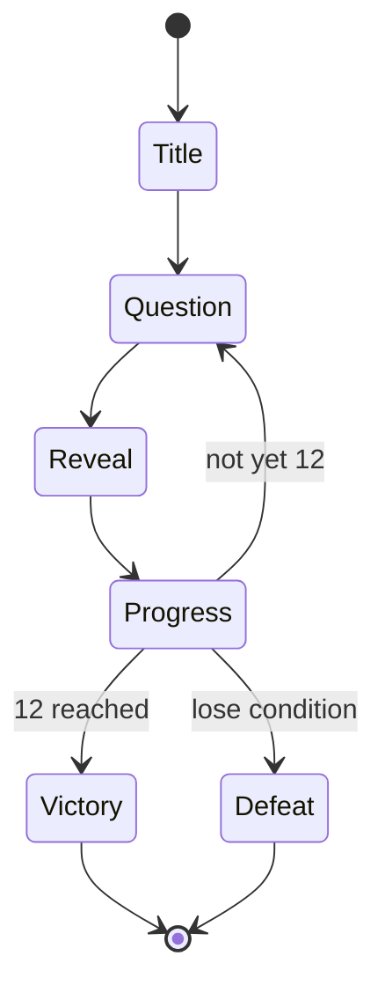

# 03 — Game Flow & Rules

**Status:** stub

## Known
- Family (one team) vs. gamemaster.
- 12 questions to victory.

## Draft flow

## To define (see open-questions.md)
- Must all 12 be correct in a row, or is it 12 correct before some limit?
- Lose condition: limited lives or wrong answers? Does a wrong answer end the game?
- Does difficulty rise along the ladder?
- Jokers or lifelines? Timer?
- Who judges an answer: the gamemaster only?

## Tasks
- [ ] GF-1 Write the full rule set.
- [ ] GF-2 Define the question-selection algorithm (difficulty curve, category mix, skip burned).
- [ ] GF-3 Define the screen states and transitions.
- [ ] GF-4 Implement the game state machine.
