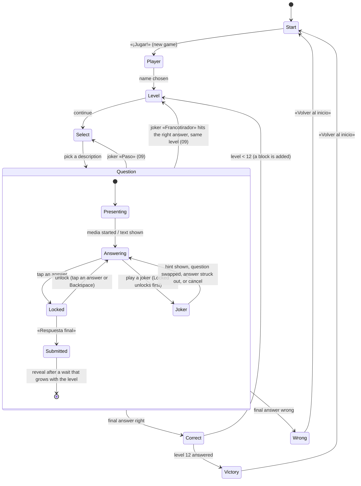

# 04 — TV Display, Screens, Sound & Motion

**Status:** draft

The game as the family sees it on the TV: screen states, transitions, sound and animation. Rules come from `03-game-flow.md` (D-20). The visual and audio contract is decided in D-21. UI copy is Spanish (D-6). The examples below are suggestions, and the gamemaster has the final say.

## Requirements
- Full-screen, 16:9, readable from the couch with a **compact** type scale and high contrast. The look (colours, type, glass panels, components) is owned by `10-visual-design.md` (D-29).
- A full-bleed background image for each question. Everything over it is a separate, semi-transparent glass panel (no full-width scrims), so the picture stays visible (D-29).
- Decorative images are blurred and slightly darkened, with a big question mark in the centre (D-15), so they read as mood, not as a clue. Illustrative and essential media are shown sharp (D-24).
- Progress is shown as a **tower of blocks** that grows by one block per correct answer and gets narrower towards the top (see Level screen).
- Players choose each question by its humorous `description` (D-8). The category is never shown.
- A subtle media credit line in a corner whenever media is shown (IMG-4, `06-images.md`).
- Every screen change is a **transition with its own sound effect** (see Transitions).
- Suspenseful background music on a loop at low volume, in three intensities: normal, question selected and answer submitted (D-22).
- A **joker tray** on the Question screen (read-only on Level and Select), with an animation for every joker (D-26, `09-jokers.md`).
- Everything runs offline: sounds, music, fonts and animations ship with the client. No CDN, and no new npm dependencies (AGENTS.md).

## Screen states

The joker sub-states (skip choice, category picker, snipe aiming) are detailed in `09-jokers.md`. The **admin overlay** is orthogonal to all of these: `Esc` opens it over any state and pauses that state (see Admin overlay).

| State | Shows | Leaves via | Music |
|---|---|---|---|
| Start | Title, «¡Jugar!», "continue game" if one is running | Click / `Enter` | Normal |
| Player | «¿Quién juega?»: known names, new name | Click a name / type + `Enter` | Normal |
| Level | The tower, «Nivel N de 12» | Click / `Enter` / `Space` | Normal |
| Select | 4 description cards | Click a card / `1`–`4` | Normal |
| Question | Question, 4 answers, media, lock, final button, joker tray | Final answer; jokers Paso / Francotirador hit | Intense (off while question media plays); after submitting: most intense |
| Correct | Fanfare, fireworks overlay, correct answer, `fun_fact` | Click / `Enter` | Fanfare replaces the music, then Normal |
| Wrong | Dark animation, correct answer, consolation | «Volver al inicio» | Off; a sad sting |
| Victory | Full 12-block tower, big finale | «Volver al inicio» | Victory jingle |

### Start
- Game title, a short subtitle, a big «¡Jugar!» button.
- The first click is also the **audio unlock**. Browsers block sound and autoplaying video with sound until a user gesture, so nothing plays before it. After this click, autoplay works for the rest of the session.
- If an unfinished game exists (server state, GF-4), show «Continuar» with its player and level («Continuar: Sofía, nivel 5») next to «Nueva partida».

### Player (D-28)
- «¿Quién juega?»: the known player names as big buttons (most recent first, keys `1`–`9`), plus «Nuevo jugador» with a text field (the TV machine's keyboard, OQ-11).
- After a name is chosen, the server runs the supply check **for that player** (GF-5); if it fails, the screen says which levels lack questions, as the Start screen does today.
- Each name can be deleted with all its games and progress (GF-7): a small trash button on hover or keyboard focus, then a confirmation.
- A short greeting with the name («¡Hola, Sofía!») plays into the transition to Level. The name stays in a corner of the Level screen.
- Idle animation so the TV doesn't look frozen, e.g. the empty foundation slowly breathing, or floating question marks.

### Level (between questions)
Players start at **level 1** (easiest question) and must answer **level 12** to win (D-20). Before every question, they see where they are.

- **The tower (D-22):** a wide foundation at the bottom, with **12 block slots** above it. Each block is **narrower than the one below**, so the tower tapers towards the top (block 1 is about 90 % of the foundation's width, block 12 about 35 %; block heights stay similar, so the tower doesn't look squat). Slots that aren't earned yet are faint dotted outlines, so the goal height is always visible. Each correct answer adds one solid block.
- **Block arrival:** when the Level screen follows a correct answer, the new block drops from the top of the screen, lands with a squash-and-settle bounce and a **thud**, and the tower wobbles slightly. The thud's pitch rises with each level, so height sounds like progress. On level 1 (the empty foundation), a soft "ready" sound plays instead.
- Blocks look varied: a different colour or texture per level, or per broad category of the question answered (a reason to keep the history, B-1). Higher blocks get fancier (stone → brick → marble → gold). Level 12 gets a crown or flag slot at the top.
- Text: «Nivel 3 de 12». Optional milestone lines at levels 4 and 8 («¡Ya vamos por la mitad!» at 6).
- The camera follows: the view scrolls or scales so the top of the tower and the next empty slot stay in frame.
- **Repeat (09):** after a Snipe hit, the Level screen comes in with a rewind effect instead of black, no block drops, and the text reads «Nivel N de 12 — otra vez».
- The joker tray is shown small and read-only, as a reminder of the jokers (09).

### Question selection
Four cards, each showing only a question's `description` (D-8). The players pick one.

- **Quirky design:** cards as sealed envelopes, mystery boxes or old library index cards. Each is tilted at a slightly different angle, with a hand-drawn number (1–4), a wax seal or postage stamp, and a gentle idle wobble. Hover or focus lifts a card and straightens it. A random doodle can sit in a corner (a coffee ring, a paper clip, a googly-eyed question mark).
- Cards deal in one at a time with a paper "flick" sound (part of the transition into Select).
- **Picking:** click or press `1`–`4`. An **immediate short sound** plays (a "pop", stamp or seal crack), the chosen card pulses or tears open, the other three slide off, then the transition to the Question screen starts. No confirmation step.
- There are **always 4 cards** (D-22). They come from the level's difficulty range (GF-2, `03-game-flow.md`). The unchosen questions are not burned (D-20). A card that replaces a skipped or purged one deals in highlighted («¡Nueva!», 09).

### Question
- Full-bleed media background (D-15 rules), the question in a floating glass card at the top, four answer tiles (A–D) in a 2×2 grid at the bottom, at most 70 % wide. The credit line is in a corner. Layout sketch and tile states: `10-visual-design.md`.
- The `description` is **not** shown here: it belongs to the Select screen only (D-8). Once the question is on screen, only the question itself is shown.
- **Media autoplays** once the screen has faded in: audio and video start from the start. The intense question music is faded out before the media starts and fades in when the media ends. A small replay button (`R`) restarts the media. Images need nothing.
- **Hints:** only through the «Soplo» joker (D-26). Space under the question band is reserved for the hint notes (09).
- **Joker tray:** five tokens along the left edge (09). Jokers are playable until «Respuesta final»; their animations are in `09-jokers.md`.
- **Locking in:** tapping an answer (click or `A`–`D` / `1`–`4`) locks it in:
  1. A heavy **lock "clunk"** sound plays, and the chosen answer gets a bright frame with a small padlock icon. The other answers dim.
  2. Below the answers sits a **big padlock** (or a vault door / chain) that has been covering the final-answer button. After a short suspense beat (~0.8 s), it unlocks with a click, swings or slides away (~0.6 s) with a metallic sound, and reveals the **«Respuesta final»** button.
- **Going back (D-22):** while an answer is locked in, tapping any answer (or `Backspace`) **unlocks** it. This is the lock-in animation in reverse: the big padlock swings back in front of «Respuesta final» and closes with a clunk, the answer's frame and padlock icon go away, and the other answers brighten again. **No answer is locked in afterwards**; the players tap again to lock in an answer, the same one or another. This leaves room for family debate.
- **Final answer:** «Respuesta final» (click or `Enter`) submits. The answers can't be changed any more, the screen darkens around the question, and the music switches to the **most intense track** (see Music). The players then wait; the higher the level, the longer the wait:

  | Level | 1–2 | 3–4 | 5–6 | 7–8 | 9–10 | 11 | 12 |
  |---|---|---|---|---|---|---|---|
  | Wait before the reveal | 3 s | 4 s | 5 s | 6 s | 8 s | 10 s | 12 s |

  The values are a starting point, to be tuned on the TV (UI-6). At the reveal, the music transitions straight into the fanfare (right) or the sad sting (wrong), with no silence in between. The right answer flashes green. On a wrong answer, the chosen answer flashes red as well, and the right one flashes green, so the players always see the right answer (D-22). Then the result screen follows.

### Correct
- A **fanfare / jingle** plays (several variants, picked at random so it doesn't get stale).
- **Fireworks overlay:** one of several animations, picked at random, drawn on a full-screen transparent `<canvas>` **over** the question screen, with the correct answer still visible underneath. Variants: classic rockets with bursts, confetti cannon from both bottom corners, a ring or heart burst, sparkler trails, a falling-stars shower. Each variant runs about 3 s. They are hand-written canvas code with no library (UI-9).
- Then a panel shows the correct answer and the `fun_fact`.
- Continue (click / `Enter`) → transition → Level screen, where the new block drops in. After level 12 → Victory.

### Wrong
- The game ends (D-20). The submitted music has already turned into a **sad sound** (a descending trombone "wah-wah", or a low gong) at the reveal. No music plays on this screen.
- **Dark animation:** colour drains from the screen (desaturate), a vignette closes in, and the tower (shown small) crumbles, or its blocks fall away one by one with soft thuds. Rain or a slow fade to deep blue also works. It should be gentle, not scary; the players are 11 and 12 (D-6).
- Then the **correct answer** and the `fun_fact` are shown (D-22), with a **consolation message** that names the level reached: «¡Llegaron al nivel 7! Eso es más alto que la mayoría de las torres…». There are several messages, chosen by how far the players got.
- One button: **«Volver al inicio»** → transition → Start.

### Victory
- After the 12th correct answer: the Level screen shows the 12th block landing, the crown on top, a long fireworks finale (all variants in sequence) and a victory jingle. Text: «¡Ganaron!».
- «Volver al inicio» → Start.

## Transitions
Every change between the states above uses one transition routine with these steps:

1. **Music fades out** (~600 ms, linear gain ramp to 0).
2. **Transition sound effect** starts. Each state change has its own sound, e.g. whoosh (Start→Level), paper flick (Level→Select), pop (the pick sound itself, then a swoosh into Question), a deep "boom" (into Correct or Wrong, after the reveal).
3. **Fade to black** (~400 ms). Some transitions use a wipe, iris or card-flip instead of black when it fits the next screen. Black is the default.
4. The next screen mounts behind the black, and media and images preload. The transition waits for preloading, up to 2 s.
5. **Fade in** (~400 ms).
6. **Music fades back in** (~800 ms): the track that belongs to the new state (see Music), unless the state keeps it off (Question with media, Wrong, Victory).

Jokers add transitions **inside** the Question state (card flip for swapped questions, sweep for a skip, rewind for a Snipe hit); they use the same input lock and audio fades (09).

Input is ignored while a transition runs, so a double tap can't skip a state. All durations are constants in one file, so they can be tuned on the real TV (UI-6).

## Audio

### Channels
| Channel | Content | Default level | Notes |
|---|---|---|---|
| Music | Three suspenseful loops (see Music) | low, ~15 % | Fades out on transitions and during question media |
| Effects | Transition sounds, lock, thud, fanfare, fireworks pops | ~70 % | Never ducked |
| Question media | Audio and video from the pool (06) | 100 % | Music is off while it plays |

### Music (D-22)
Three loops of the same suspenseful theme, getting more intense. It's best if all three share key and tempo, so they can follow each other without clashing.

| Track | Plays during | Character |
|---|---|---|
| `normal` | Start, Level, Select | Calm but suspenseful: low pads, a soft pulse |
| `question` | Question screen, from the fade-in while no answer is locked in | More intense: faster pulse, ticking, strings |
| `submitted` | While an answer is locked in (gamemaster feedback, 2026-10-06) | Most intense: heartbeat or timpani rolls, rising pitch |
| `roll` | From «Respuesta final» until the reveal | A snare drum roll that builds up to the reveal |

- **Selecting a question** goes through the normal transition: `normal` fades out, then `question` fades in on the Question screen (after the question media, if any).
- **Locking in** an answer cuts sharply (~80 ms) from `question` to `submitted`; unlocking cuts back. **Submitting** cuts to the drum roll `roll`, with a short "hit" effect on top.
- **The reveal** is where the roll turns into the result: a quick fade-out (~150 ms) of `roll` overlapped with the start of the fanfare/jingle (right) or the sad sting (wrong), so the music turns into the result rather than stopping. The wait (table above) can stretch the roll; it keeps rolling at full strength.
- **After Correct,** `normal` comes back with the transition to the Level screen.

- One shared Web Audio `AudioContext` (no library). Each channel has a gain node, so fades are `linearRampToValueAtTime`. Effects are decoded once into `AudioBuffer`s at startup, so they play instantly. Each music track loops through `AudioBufferSourceNode.loop` for a gapless loop. The three tracks are decoded at startup too.
- The volume per channel and a master mute are set in the admin overlay and remembered in `localStorage` (or the server settings).

### Sound assets
- Files live in `client/public/audio/` (`music/`, `sfx/`), go into `client/dist/` at build time and are served offline like the rest of the client.
- Only free licences: CC0 preferred, CC BY with a credit in `client/public/audio/CREDITS.md` (no credits screen, gamemaster 2026-10-06). Sources: Wikimedia Commons (as for question media, D-13), freesound.org CC0, OpenGameArt. Unlike question media (D-17), all audio that is part of the UI (music and effects) gets committed to the repo, with a `CREDITS.md` next to it (D-22). Files should be compressed (Ogg Vorbis/Opus, or MP3) to keep the repo small.
- A fallback for every effect that has no asset yet: a short synthesized sound (oscillator + envelope) generated in code, so the game is never silent during development.
- Starter list: music `normal`, `question`, `submitted`; whoosh; paper flick; card pick pop; lock clunk; lock open; padlock close (unlock); submit hit; reveal boom; correct reveal ding; 3+ fanfares; firework launch and burst; block thud; sad trombone; victory jingle; menu open and close; plus the joker sounds listed in `09-jokers.md`.

## Admin overlay
`Esc` opens a semi-transparent menu over any screen. It pauses the current state: question media pauses and animations freeze. `Esc` again closes it and resumes. The family sees the overlay, so it never shows the correct answer. A separate GM view is GM-3 (05).

Menu items (keyboard-navigable, large enough for the TV):
- **Continuar** (close).
- **Volumen:** music, effects and media sliders, plus mute all.
- **Saltar pregunta:** back to Select with a new card replacing the current question, without using a joker. The skipped question is burned for the player (D-28).
- **Saltar y quemar para todos:** the same, but the question is burned for **every** player: for a wrong, broken or ambiguous question. Needs a confirmation.
- **Deshacer:** take back the last final answer, if the gamemaster misjudged or someone pressed by accident (GM-2).
- **Reiniciar partida / Volver al inicio,** with a confirmation.
- **Pantalla completa** on/off.
- **Question ID** for debugging, in small type: the question on screen, or else the last one answered («última»). The ID gives nothing away, and it finds the question in `data/questions.json` and the review tool (`/review?id=…`).
- **Demo de efectos** (later): play every transition and effect for testing on the TV (B-3).

The detailed action set and any extra keys are owned by `05-gamemaster-controls.md` (GM-2). This plan only fixes that the overlay exists and opens with `Esc`.

## Input
For now, everything works with a mouse and with the keyboard of the TV machine (OQ-11): `Enter`/`Space` = continue or confirm, `1`–`4` / `A`–`D` = pick a card or an answer, `R` = replay media, `S` `P` `F` `T` `X` = jokers (09, D-30), `Backspace` = unlock or cancel, `Esc` = admin overlay. A clicker or phone remote can map to these later.

## Implementation notes
- The game is the start page `/`; the review tool lives at `/review` (D-25). It is a Svelte state machine (`client/src/game/`), and each state is a component.
- **Placeholders (D-25):** until a polish task is done, its part of the screen shows a dashed box or caption `PLACEHOLDER · <task ID>`, and the code carries a `PLACEHOLDER(<task ID>)` comment. Sounds show a caption instead of playing. `grep -rn PLACEHOLDER client/src` lists what's left. A `Transition` wrapper owns the black layer and the audio fades.
- Game state lives on the server (SQLite, D-4) and is written on every final answer, so a page reload or crash resumes at the same level (GF-4).
- Animations use CSS transitions or keyframes plus the canvas for fireworks. They respect a "reduced motion" admin toggle (no effect on sound).

## Tasks
- [x] UI-1 Define the visual style (fonts, colours, mood board), including the look of the tower blocks (D-22). *2026-10-06: `10-visual-design.md` (D-29), implemented (VD-2..VD-8), confirmed (VD-1).*
- [x] UI-2 Design the question screen layout with the image overlay, answers, padlock and final-answer button. *2026-10-06: VD-4.*
- [x] UI-3 Design the tower component: foundation, 12 tapering block slots, block variants, drop and settle animation. *2026-10-06: VD-7. The whole tower fits on screen, so no camera follow is needed.*
- [x] UI-4 Design the reveal, Correct, Wrong and Victory animations. *2026-10-06: reveal pop/shake, Wrong desaturates with a vignette and the tower crumbles, Victory with crown and gold stage; the fireworks are UI-9. Fireworks done with UI-9.*
- [-] UI-5 ~~Optional: sound effects and music.~~ Sound is now required (D-21); split into UI-8 and UI-10.
- [ ] UI-6 Test on the actual TV (overscan, resolution, viewing distance, volume levels, transition timings).
- [x] UI-7 Implement the screen state machine and the shared transition routine (fade, black, input lock). *2026-10-06: `client/src/game/Game.svelte` (D-25); no preloading yet (`PLACEHOLDER(UI-7)`). Fixed: a new game state that the old screen can't show (after an answer, undo, skip, Paso, a Snipe hit) is now applied behind the black (`go(…, apply)`); before, «Esta pantalla no tiene datos» flashed during the fade.*
- [x] UI-8 Audio engine: AudioContext, three channels with gain, fades and crossfades, three gapless music loops, unlock on the first click, synthesized fallbacks. *2026-10-06: `client/src/game/sound.svelte.ts`. No sound files yet (UI-10), so all of it is synthesized: the three loops are one generated theme (A minor, i–VI–III–V) at 76/96/120 bpm with a lookahead scheduler (normal: pad + soft pulse; question: + ticking; submitted: heartbeat, timpani roll, a pad that creeps upwards); every effect name maps to a small recipe (whoosh, paper flick, pop, lock clunk/open, boom, block thud rising with the level, fanfare, sad trombone, rewind, menu blips, joker sounds). Gamemaster feedback: the boom into ¡Correcto! didn't fit; it is now synthesized applause (3 s, a longer «gran aplausos» into Victory); Wrong keeps the boom. Music fades 600/800 ms on screen changes, crossfades 300 ms into «submitted», ducks to 50 % while a joker plays. Audio unlocks on the first click or key. The captions placeholder is gone.*
- [x] UI-9 Fireworks overlay: canvas with at least 4 variants, random pick, finale mode. *2026-10-06: `client/src/game/Fireworks.svelte`, hand-written particles on a full-screen canvas: rockets with bursts, confetti cannons from both bottom corners, ring and heart bursts, sparkler figure-eights, falling stars (one at random on ¡Correcto!); Victory plays all five in sequence plus a final volley (~13 s). Launch, burst, cannon, sparkler and star sounds are synthesized. Preview over the Start screen: `/?fuegos=rockets|confetti|shapes|sparklers|stars|finale`. Off with reduced motion.*
- [~] UI-10 Source sound assets (CC0/CC BY), add `client/public/audio/CREDITS.md`. *2026-10-06: the gamemaster found the synthesized applause and drum roll low quality; recorded ones from Wikimedia Commons now replace them (`aplausos.m4a` CC0, `aplausos-gran.m4a` public domain, `redoble.m4a` US Air Force Band, public domain; AAC, loudness-normalized, credits in `CREDITS.md`). `sound.svelte.ts` decodes them after the unlock and falls back to synthesis if one is missing. Converted with ffmpeg from `nix shell nixpkgs#ffmpeg-headless` (not a project dependency). Second round, also from Commons: fanfare (US Air Force band, public domain), sad trombone (Joe Lamb, CC BY 3.0), padlock close/open (SpaceJoe, CC0), page flick, block thud and firework burst (pdsounds.org, public domain), glass shatter (Gravity Sound, CC BY 4.0), stamp (Subhashish Panigrahi, CC BY 3.0); 12 files, ~700 kB. Still synthesized: the three music loops, whooshes, pops, menu blips, the joker shimmer, slide whistle, shredder, heartbeat, rewind. Commons had no usable whoosh (only spoken-word recordings); Kenney.nl's CC0 packs are the next source to try. CC BY credits stay in `CREDITS.md`; no credits screen in the game (gamemaster, 2026-10-06). The remaining synthesized sounds are fine for now (gamemaster, 2026-10-06).*
- [~] UI-11 Question selection screen: 4 quirky cards, deal-in, pick sound, chosen-card animation. *2026-10-06: envelopes with wax seals, tilt, deal-in, hover lift, chosen card pulses and the others slide off. Left: tear-open of the chosen card, «¡Nueva!» for a replaced card (`PLACEHOLDER(UI-11)`).*
- [x] UI-12 Lock-in mechanic: answer lock, padlock reveal of «Respuesta final», unlock (reverse animation), submit, level-dependent wait, reveal. *2026-10-06: the big padlock shakes, opens and swings away; unlocking swings it back.*
- [x] UI-13 Admin overlay on `Esc`: pause/resume, volume, skip, undo, restart, fullscreen. *2026-10-06: `client/src/game/Overlay.svelte`; «Saltar y quemar para todos» added (GM-4); volume sliders for music, effects and question media (←/→ in 10 % steps) and «Sonido: encendido/apagado», remembered in `localStorage`.*
- [x] UI-14 Consolation and milestone copy (Spanish), several variants per level band. *2026-10-06: `client/src/game/copy.ts`.*
- [x] UI-16 Player screen: name list, new name entry, greeting; player name on Start («Continuar») and Level (D-28). *2026-10-06: `client/src/game/Player.svelte`: up to 9 known names (keys `1`–`9`, with games and wins), typing any letter starts a new name, `Enter` plays; the supply report shows if the pool can't fill a game for that player; «¡Hola, …!» before Level. The idle animation is the shared stage (drifting «?»).*
- [x] UI-15 Make room for the joker tray and hint notes in the Question layout (UI-2) and the read-only tray on Level/Select; joker work itself is JK-4..JK-9 (09). *2026-10-06: with JK-4.*
