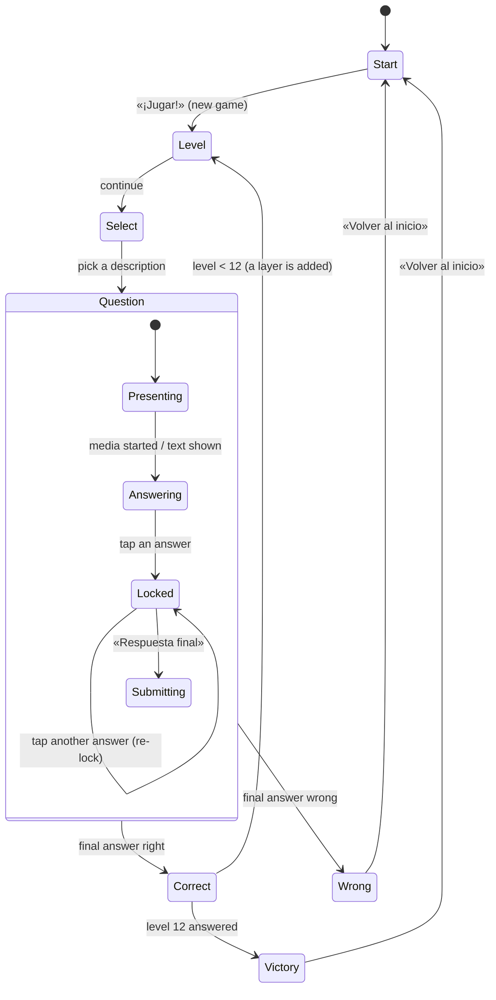

# 04 — TV Display, Screens, Sound & Motion

**Status:** draft

The game as the family sees it on the TV: screen states, transitions, sound and animation. Rules come from `03-game-flow.md` (D-20). The visual and audio contract is decided in D-21. UI copy is Spanish (D-6). The examples below are suggestions, and the gamemaster has the final say.

## Requirements
- Full-screen, 16:9, readable from several metres away (large type, high contrast).
- A full-bleed background image for each question, with an overlay or scrim so the text stays legible.
- Decorative images are blurred and slightly darkened, with a big question mark in the centre (D-15), so they read as mood, not as a clue. Essential media is shown sharp.
- Progress is shown as a **stack** that grows by one layer per correct answer (see Level screen).
- Players choose each question by its humorous `description` (D-8). The category is never shown.
- A subtle media credit line in a corner whenever media is shown (IMG-4, `06-images.md`).
- Every screen change is a **transition with its own sound effect** (see Transitions).
- Suspenseful background music on a loop at low volume.
- Everything runs offline: sounds, music, fonts and animations ship with the client. No CDN, and no new npm dependencies (AGENTS.md).

## Screen states

The **admin overlay** is orthogonal to all of these: `Esc` opens it over any state and pauses that state (see Admin overlay).

| State | Shows | Leaves via | Music |
|---|---|---|---|
| Start | Title, «¡Jugar!», "continue game" if one is running | Click / `Enter` | Loop (title variant optional) |
| Level | The stack, «Nivel N de 12» | Click / `Enter` / `Space` | Loop |
| Select | 4 description cards | Click a card / `1`–`4` | Loop |
| Question | Question, 4 answers, media, lock, final button | Final answer | Off while question media plays, else loop |
| Correct | Fanfare, fireworks overlay, correct answer, `fun_fact` | Click / `Enter` | Fanfare replaces the loop |
| Wrong | Dark animation, correct answer, consolation | «Volver al inicio» | Off; a sad sting |
| Victory | Full 12-layer stack, big finale | «Volver al inicio» | Victory jingle |

### Start
- Game title, a short subtitle, a big «¡Jugar!» button.
- The first click is also the **audio unlock**. Browsers block sound and autoplaying video with sound until a user gesture, so nothing plays before it. After this click, autoplay works for the rest of the session.
- If an unfinished game exists (server state, GF-4), show «Continuar» (resume at its level) next to «Nueva partida».
- Idle animation so the TV doesn't look frozen, e.g. the empty foundation slowly breathing, or floating question marks.

### Level (between questions)
Players start at **level 1** (easiest question) and must answer **level 12** to win (D-20). Before every question, they see where they are.

- **The stack:** a foundation (a stone plinth or slab) at the bottom, with **12 slots** above it. Slots that aren't earned yet are faint dotted outlines, so the goal height is always visible. Each correct answer adds one solid layer.
- **Layer arrival:** when the Level screen follows a correct answer, the new layer drops from the top of the screen, lands with a squash-and-settle bounce and a **thud**, and the stack shakes slightly. The thud's pitch rises with each level, so height sounds like progress. On level 1 (the empty foundation), a soft "ready" sound plays instead.
- Layers look varied: a different colour or texture per level, or per broad category of the question answered (a reason to keep the history, B-1). Later layers are bigger and fancier. Level 12 gets a crown or flag slot at the top.
- Text: «Nivel 3 de 12». Optional milestone lines at levels 4 and 8 («¡Ya vamos por la mitad!» at 6).
- The camera follows: the view scrolls or scales so the top of the stack and the next empty slot stay in frame.

### Question selection
Four cards, each showing only a question's `description` (D-8). The players pick one.

- **Quirky design:** cards as sealed envelopes, mystery boxes or old library index cards. Each is tilted at a slightly different angle, with a hand-drawn number (1–4), a wax seal or postage stamp, and a gentle idle wobble. Hover or focus lifts a card and straightens it. A random doodle can sit in a corner (a coffee ring, a paper clip, a googly-eyed question mark).
- Cards deal in one at a time with a paper "flick" sound (part of the transition into Select).
- **Picking:** click or press `1`–`4`. An **immediate short sound** plays (a "pop", stamp or seal crack), the chosen card pulses or tears open, the other three slide off, then the transition to the Question screen starts. No confirmation step.
- Card candidates come from the selection algorithm (GF-2). The unchosen questions are not burned (D-20).

### Question
- Full-bleed media background (D-15 rules), question text in a top band, four answer buttons (A–D) in a 2×2 grid at the bottom. The credit line is in a corner.
- **Media autoplays** once the screen has faded in: audio and video start from the start. The background music is faded out before the media starts and stays off until the media ends. A small replay button (`R`) restarts the media. Images need nothing.
- **Hints:** reserved space only, until OQ-15 is answered.
- **Locking in:** tapping an answer (click or `A`–`D` / `1`–`4`) locks it in:
  1. A heavy **lock "clunk"** sound plays, and the chosen answer gets a bright frame with a small padlock icon. The other answers dim.
  2. Below the answers sits a **big padlock** (or a vault door / chain) that has been covering the final-answer button. After a short suspense beat (~0.8 s), it unlocks with a click, swings or slides away (~0.6 s) with a metallic sound, and reveals the **«Respuesta final»** button.
  3. Tapping another answer before the final answer re-locks to it: the padlock snaps back over the button (clunk), then opens again. This leaves room for family debate (OQ-21).
- **Final answer:** «Respuesta final» (click or `Enter`) starts a short drum-roll (~1.5 s) over a darkened screen. Then the result is revealed: the right answer flashes green. On a wrong answer, the chosen answer flashes red as well. After that, the result screen follows.

### Correct
- A **fanfare / jingle** plays (several variants, picked at random so it doesn't get stale).
- **Fireworks overlay:** one of several animations, picked at random, drawn on a full-screen transparent `<canvas>` **over** the question screen, with the correct answer still visible underneath. Variants: classic rockets with bursts, confetti cannon from both bottom corners, a ring or heart burst, sparkler trails, a falling-stars shower. Each variant runs about 3 s. They are hand-written canvas code with no library (UI-9).
- Then a panel shows the correct answer and the `fun_fact`.
- Continue (click / `Enter`) → transition → Level screen, where the new layer drops in. After level 12 → Victory.

### Wrong
- The game ends (D-20). A **sad sound** plays (a descending trombone "wah-wah", or a low gong), and the music is already off.
- **Dark animation:** colour drains from the screen (desaturate), a vignette closes in, and the stack (shown small) crumbles or the layers fall away one by one with soft thuds. Rain or a slow fade to deep blue also works. It should be gentle, not scary; the players are 11 and 12 (D-6).
- Then the correct answer and `fun_fact` are shown (OQ-22), with a **consolation message** that names the reached level: «¡Llegaron al nivel 7! Eso es más alto que la mayoría de las torres…». There are several messages, chosen by how far the players got.
- One button: **«Volver al inicio»** → transition → Start.

### Victory
- After the 12th correct answer: the Level screen shows the 12th layer landing, the crown on top, a long fireworks finale (all variants in sequence) and a victory jingle. Text: «¡Ganaron!».
- «Volver al inicio» → Start.

## Transitions
Every change between the states above uses one transition routine with these steps:

1. **Music fades out** (~600 ms, linear gain ramp to 0).
2. **Transition sound effect** starts. Each state change has its own sound, e.g. whoosh (Start→Level), paper flick (Level→Select), pop (the pick sound itself, then a swoosh into Question), drum-roll (into the result).
3. **Fade to black** (~400 ms). Some transitions use a wipe, iris or card-flip instead of black when it fits the next screen. Black is the default.
4. The next screen mounts behind the black, and media and images preload. The transition waits for preloading, up to 2 s.
5. **Fade in** (~400 ms).
6. **Music fades back in** (~800 ms), unless the new state keeps it off (the Question screen with media, Wrong, Victory).

Input is ignored while a transition runs, so a double tap can't skip a state. All durations are constants in one file, so they can be tuned on the real TV (UI-6).

## Audio

### Channels
| Channel | Content | Default level | Notes |
|---|---|---|---|
| Music | One suspenseful loop (60–120 s, seamless) | low, ~15 % | Fades out on transitions and during question media |
| Effects | Transition sounds, lock, thud, fanfare, fireworks pops | ~70 % | Never ducked |
| Question media | Audio and video from the pool (06) | 100 % | Music is off while it plays |

- One shared Web Audio `AudioContext` (no library). Each channel has a gain node, so fades are `linearRampToValueAtTime`. Effects are decoded once into `AudioBuffer`s at startup, so they play instantly. The music loops through `AudioBufferSourceNode.loop` for a gapless loop.
- The volume per channel and a master mute are set in the admin overlay and remembered in `localStorage` (or the server settings).

### Sound assets
- Files live in `client/public/audio/` (`music/`, `sfx/`), go into `client/dist/` at build time and are served offline like the rest of the client.
- Only free licences: CC0 preferred, CC BY with a credit on a credits screen. Sources: Wikimedia Commons (as for question media, D-13), freesound.org CC0, OpenGameArt. Unlike question media (D-17), they are small, fixed files and get committed, with a `CREDITS.md` next to them (OQ-20).
- A fallback for every effect that has no asset yet: a short synthesized sound (oscillator + envelope) generated in code, so the game is never silent during development.
- Starter list: music loop; whoosh; paper flick; card pick pop; lock clunk; lock open; drum-roll; correct reveal ding; 3+ fanfares; firework launch and burst; layer thud; sad trombone; victory jingle; menu open and close.

## Admin overlay
`Esc` opens a semi-transparent menu over any screen. It pauses the current state: question media pauses and animations freeze. `Esc` again closes it and resumes. The family sees the overlay, so it never shows the correct answer. A separate GM view is GM-3 (05).

Menu items (keyboard-navigable, large enough for the TV):
- **Continuar** (close).
- **Volumen:** music, effects and media sliders, plus mute all.
- **Saltar pregunta:** replace the current question with a new one at the same level. For a broken image or an ambiguous question, the gamemaster decides. The skipped question is not burned.
- **Deshacer:** take back the last final answer, if the gamemaster misjudged or someone pressed by accident (GM-2).
- **Reiniciar partida / Volver al inicio,** with a confirmation.
- **Pantalla completa** on/off.
- **Demo de efectos** (later): play every transition and effect for testing on the TV (B-3).

The detailed action set and any extra keys are owned by `05-gamemaster-controls.md` (GM-2). This plan only fixes that the overlay exists and opens with `Esc`.

## Input
For now, everything works with a mouse and with the keyboard of the TV machine (OQ-11): `Enter`/`Space` = continue or confirm, `1`–`4` / `A`–`D` = pick a card or an answer, `R` = replay media, `Esc` = admin overlay. A clicker or phone remote can map to these later.

## Implementation notes
- The game gets its own route (`/` or `/play`; the review tool moves to `/review`, ARC decision pending). It is a Svelte state machine (`game/`), and each state is a component. A `Transition` wrapper owns the black layer and the audio fades.
- Game state lives on the server (SQLite, D-4) and is written on every final answer, so a page reload or crash resumes at the same level (GF-4).
- Animations use CSS transitions or keyframes plus the canvas for fireworks. They respect a "reduced motion" admin toggle (no effect on sound).

## Tasks
- [ ] UI-1 Define the visual style (fonts, colours, mood board), including the stack theme (tower, cake, pyramid…).
- [ ] UI-2 Design the question screen layout with the image overlay, answers, padlock and final-answer button.
- [ ] UI-3 Design the stack component: foundation, 12 slots, layer variants, drop and settle animation.
- [ ] UI-4 Design the reveal, Correct, Wrong and Victory animations.
- [-] UI-5 ~~Optional: sound effects and music.~~ Sound is now required (D-21); split into UI-8 and UI-10.
- [ ] UI-6 Test on the actual TV (overscan, resolution, viewing distance, volume levels, transition timings).
- [ ] UI-7 Implement the screen state machine and the shared transition routine (fade, black, input lock).
- [ ] UI-8 Audio engine: AudioContext, three channels with gain, fades, gapless music loop, unlock on the first click, synthesized fallbacks.
- [ ] UI-9 Fireworks overlay: canvas with at least 4 variants, random pick, finale mode.
- [ ] UI-10 Source sound assets (CC0/CC BY), add `client/public/audio/CREDITS.md`.
- [ ] UI-11 Question selection screen: 4 quirky cards, deal-in, pick sound, chosen-card animation.
- [ ] UI-12 Lock-in mechanic: answer lock, padlock reveal of «Respuesta final», re-lock, drum-roll and reveal.
- [ ] UI-13 Admin overlay on `Esc`: pause/resume, volume, skip, undo, restart, fullscreen.
- [ ] UI-14 Consolation and milestone copy (Spanish), several variants per level band.
