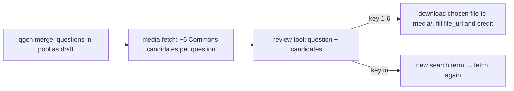

# 06 — Images and Media

**Status:** draft

## Scope
All question media (D-7): images (most questions), plus audio and video. Each question carries a `media.query` search term; picking fills `source_url` (the Commons page), `file_url` (the exact file downloaded) and `credit`.

## Sources (D-13)
*D-45 adds more providers next to Commons: [`23-media-providers.md`](23-media-providers.md).*

- **Wikimedia Commons only**, for images, audio and video. It's reliable and freely licensed, and its API returns the metadata needed for credits.
- **No songs and no film clips.** They aren't on Commons, and sourcing them by hand is too much work. Questions must not depend on a song recording or a film clip. Song *knowledge* questions with a decorative image are fine.
- Audio from Commons: animal sounds, instruments, natural sounds, public-domain recordings.
- Video from Commons: e.g. NASA footage, nature, sport. Nice to have; if no suitable video exists, the question falls back to an image.
- Unsplash, Pexels and own photos are not used for now.

## Local cache (IMG-1, D-17)
Don't hotlink at game time. Every chosen file is **downloaded once into `media/`**, so the game works offline and never shows a broken link. `media/` is gitignored: the repo is public and only stores URLs.
- The question stores `file_url`, the exact URL downloaded. The cached file is `media/<sha1(file_url)[:16]><ext>`, so the name follows from the URL; no table is needed.
- The server serves `GET /media?url=<file_url>` for any URL that appears in the pool. On a cache miss it downloads the file first (review tool and game alike). Downloads go to a temp file and are renamed into place, so an interrupted download never looks cached.
- `trivia-media sync` downloads every missing file ahead of time (run it before game night); `--prune` deletes files no question references.
- Images larger than 2560 px are downloaded as a Commons thumbnail at 2560 px width (for 4K TVs); `file_url` is then the thumbnail URL. Smaller originals are downloaded as they are.
- Every request sends a descriptive User-Agent, as Wikimedia's policy requires.

## Requirements (IMG-3)
- **Licence:** free (public domain, CC0, CC BY, CC BY-SA). The author and licence go into `credit`.
- **Images:** landscape, at least 1920 px wide for decorative images (essential images may be smaller if nothing better exists); no visible text that gives the answer away.
- **Decorative media** must not reveal the answer (no Eiffel Tower for "capital of France").
- **Illustrative media** (D-24) shows something that belongs to the question (its subject, a place or object it mentions, the setting of a film), but never the answer and nothing that rules options in or out. Same size rules as decorative images.
- **Essential media** must show exactly what the question asks about (`media.note` says what).
- **Audio:** a short clip; the game plays it from the start.

## Pipeline: media is ready before review
Media is sourced **before** the gamemaster review, so a question and its media are judged together and "bad image" can be feedback. Fetching uses no Claude, so it's cheap even for questions that get rejected later.

1. **Fetch candidates** (`authoring/tools/media.py fetch`, Python standard library, no Claude). For every slot without `file_url`: search Commons with `media.query`, filtered by type, licence, orientation and size. Save up to 6 candidates (preview URL, file URL, size, author, licence, page URL) to `work/media/<question id>.json`. The review tool loads previews straight from Commons (review needs internet anyway; only the picked file is downloaded).
   - Commons requires every search word to match, so long queries are retried shorter: filler words ("footage", "aerial", "classic"…) removed, then one word dropped at a time, never below two words. Looser queries stop once 3 candidates are found.
   - At most 2 candidates per author, so one prolific uploader doesn't fill all six slots.
   - Videos use Commons' WebM versions (720p/1080p), not the large originals.
   - At most one request per second; rate limits (HTTP 429) are waited out.
2. **Pick in the review tool.** The first candidate is shown as the suggestion; approving (`a`) picks it automatically. Key `c` shows all candidates, and then `1`–`6` pick another one. Picking makes the server download the file into the cache and fill `source_url`, `file_url` and `credit`.
3. **No fitting candidate:** key `m` opens a box for a new search term. The server saves it as `media.query` and fetches fresh candidates right away.
4. **Video without results:** the fetch step fills the remaining slots with images for the same query. Picking an image candidate switches `media.type` to `image`.

Optional later: Claude ranks the candidates first (looks at the thumbnails: is it nice, does it show the answer, does it contain revealing text), so the best one is usually `1`. Only worth it if picking turns out to be slow.

## Existing questions affected by D-13
- q-0072 (The Beatles): the decorative song recording becomes a decorative image.
- q-0067 (vallenato, essential audio): needs a traditional vallenato recording from Commons; if none exists, the question needs work.
- The 4 videos in the first 120 (Caño Cristales, ocean, Apollo 11, marathon) stay videos if Commons has one, otherwise they fall back to images.

## Background image for audio questions (D-14)
An audio question has no picture of its own, and a picture of the answer would give it away. So audio questions get a second slot, `background`: a generic, decorative image (`background.query`, e.g. "misty forest" for a bird call). It goes through the same steps as other media: candidates in `work/media/<id>-background.json`, cached like any other file, credit shown on screen. In the review tool, `b` shows its alternatives (like `c` for the main media), and approving picks both suggestions.

## Credits on screen (IMG-4)
The TV shows a subtle credit line in a corner while media is shown, e.g. "Foto: Jane Doe · CC BY-SA 4.0 · Wikimedia Commons". Small, low contrast, never covering the question.

## Tasks
- [x] IMG-1 Decide between hotlinking and a local cache. *2026-10-06, local cache (D-13).*
- [x] IMG-2 `authoring/tools/media.py fetch`: Commons search → candidates and preview thumbnails in `work/media/`. *2026-10-06, `authoring/tools/media.py`.*
- [x] IMG-3 Define media requirements. *2026-10-06, see "Requirements".*
- [x] IMG-4 Decide whether to show credits on screen (subtle) or only in the data. *2026-10-06, subtle credit line on screen.*
- [x] IMG-5 Server: `POST /api/questions/<id>/media` (pick a candidate → download, fill credit) and `POST /api/questions/<id>/media/search` (new query → fetch again). *2026-10-06, then `server/main.py`, now `authoring/server/main.py` (D-35).*
- [x] IMG-6 Review tool: show candidates (images, audio and video players), keys `1`–`6` to pick, `m` for a new search term; show the chosen media. *2026-10-06, `authoring/ui/src/review/MediaPanel.svelte`.*
- [x] IMG-7 Apply D-13 to the existing pool (q-0072 to an image) and to the generator (`house-style.md`, `authoring/data/question-styles.txt`: no song or film clip questions). *2026-10-06, q-0072 now uses a decorative image.*
- [x] IMG-9 Background slot for audio questions (D-14): schema, `background_query` in the generator, background queries for the 6 existing audio questions. *2026-10-06.*
- [x] IMG-10 Background in `media.py fetch`, the server (pick/search per slot) and the review tool (`b`, auto-pick on approve). *2026-10-06.*
- [x] IMG-8 `qgen.py validate`: `local_path` exists when set. *2026-10-06.*
- [x] IMG-11 URL-keyed media cache (D-17): `file_url` replaces `local_path` in schema, `media.py`, `qgen.py`, server (`GET /media?url=`, download on miss) and review tool; migrate the existing files from `images/` and `media/` into the cache; `media/` in `.gitignore`. *2026-10-06; 112 slots migrated (111 files, two questions share one), `images/` removed.*
- [x] IMG-12 `media.py sync [--prune]`: fill the cache for all picked media; remove unreferenced files. *2026-10-06.*
- [x] IMG-14 New media role `illustrative` (D-24) in schema, `qgen.py`, `media.py`, review tool. Then go through the approved first-120: give every question a related image where one can't give the answer away, picked by Claude from the thumbnails (was B-4). *2026-10-06: 115 approved questions now `illustrative` (114 images, the Apollo 11 video). 68 got a new search term and pick, 47 kept a pick that already fit. Every pick checked on a thumbnail sheet; rejected candidates that showed the answer (Paris 2024 rings for the 5 rings, a drum kit, a Van Gogh painting, "STRAIT" on a hull). The blue whale and marathon videos became images. The audio questions' backgrounds stay decorative. Approved by the gamemaster.*
- [x] IMG-13 `qgen.py validate`: warn (not fail) when an approved question's media isn't cached (or isn't picked). *2026-10-06.*
- [x] IMG-15 Identified Commons requests: a User-Agent with contact (the repo URL), and the owner-only OAuth 2.0 token `COMMONS_ACCESS_TOKEN` as a bearer header on API calls (search, `imageinfo`). The token lives in the gitignored `.env.local`, loaded by direnv; without it the tools work as before, anonymously. File downloads and the game never send it. *2026-10-08: Wikimedia rate-limits anonymous API calls harder (Phase 2, April 2026).*
