# 07 — Question Generation

**Status:** draft

## Purpose
How new questions get into the pool: drafting, rating, fact-checking, reviewing, attaching media, and validating before a question is accepted. The pool (`02-question-pool.md`) defines *what* a question is; this file defines *how* questions are produced.

## Settled so far
- Questions are AI-drafted; the gamemaster reviews every one (D-7).
- Spanish, Colombian usage, for two kids aged 11 and 12; difficulty 1–10 (D-6).
- Drafts live in the pool with `status: "draft"` (D-7).
- First batch: 120 questions over 10 categories (QP-5).

## Inputs for batch generation
Throw-away working files in the repo root, edited by the gamemaster:
- `data/categories.json`: 140 subcategories grouped into 24 broad categories (D-19).
- `question-styles.txt`: ~30 question styles, sorted from best to worst fit for a multiple-choice family trivia game. Styles near the top use the TV's picture and sound (name the thing in the picture, what makes this sound, which song is this), followed by quick, concrete styles (plain fact, biggest/smallest, "name the concept").

The full grid (subcategories × styles ≈ 4,300 combinations) is far too many to write and review. The strategy below keeps quality high and the gamemaster's review time low.

## Strategy for large batches

### Principle
Writing questions is cheap; **the gamemaster's review time is the bottleneck.** Every step exists to put fewer, better questions in front of the reviewer.

### Pipeline

```mermaid
flowchart LR
  Fit[1 Fit table: subcategory × style] --> Draft[2 Draft questions for good pairs]
  Draft --> Rate[3 Separate rating pass]
  Rate --> Check[4 Fact-check numbers, dates, records]
  Check --> Dedupe[5 Duplicate check against pool]
  Dedupe --> Filter[6 Drop below quality threshold]
  Filter --> Media[7 Fetch media candidates]
  Media --> Review[8 Gamemaster review + pick media]
  Review --> Pool[Approved in pool]
```

1. **Fit table first.** Before writing any question, score every subcategory × style pair for fit (e.g. "sound → Matemáticas" doesn't fit). This is cheap. Then write questions only for the best 3–4 styles per subcategory, not for all 30.
2. **Draft with skipping allowed.** For each chosen pair, try to write one question. If it comes out forced, skip it. No question is better than a filler question.
3. **Rate in a separate pass.** Don't rate questions while writing them: self-ratings while writing come out too high and too similar. A second pass scores each finished question against the rubric below, one score per criterion, with a short reason for low scores.
4. **Fact-check.** Every question with a number, date, record or superlative is verified with a web search and marked as checked. A bigger pool means more errors to catch.
5. **Duplicate check** against the whole pool, including burned questions (e.g. Gabo already appears in three questions).
6. **Filter** below a quality threshold. The threshold is calibrated against the gamemaster's decisions on the pilot, not guessed.
7. **Fetch media candidates** from Wikimedia Commons (D-13, `06-images.md`). Questions whose style needs a specific picture, sound or video are marked `needs_media`.
8. **Gamemaster review** in the review tool (`08-review-tool.md`): decide on the question and pick its media in one go. If no candidate fits, search again or give feedback.

### Quality rubric (for step 3)
Each criterion is scored 1–5:
- **Correct:** the fact is true and verifiable.
- **Unambiguous:** exactly one option is right; no reasonable argument for another.
- **Distractors:** the wrong answers are plausible but clearly wrong once you know the answer.
- **Age fit:** matches the stated difficulty for kids aged 6–16; no adult-only references.
- **Fun:** surprising, funny or satisfying to get right; not a school test.
- **Description:** the humorous intro (D-8) works and doesn't give the answer away.

A question with **Correct** or **Unambiguous** below 4 is dropped regardless of its other scores.

### Difficulty target
New drafts follow what a game uses (D-31). Each of the 12 levels shows 4 questions from its difficulty range (D-22); spreading those 48 evenly over each range gives the share per difficulty:

| Difficulty | 1 | 2 | 3 | 4 | 5 | 6 | 7 | 8 | 9 | 10 |
|---|---|---|---|---|---|---|---|---|---|---|
| Per game | 4 | 2 | 3.3 | 5.3 | 6.7 | 7.7 | 4.7 | 4.7 | 5.3 | 4.3 |

That is about **19 %** at 1–3, **51 %** at 4–7 and **30 %** at 8–10. (Before D-31 the target was 15 / 70 / 15, which left the top levels short.)

AI difficulty estimates are guesses. The real calibration comes from game nights: the session log (B-1) records which questions were answered correctly, so levels can be corrected over time.

### Pilot before scaling
Before generating hundreds of questions:
1. Pick ~10 subcategories with a spread of topics.
2. Build their fit table and draft ~60–80 questions, weighted to levels 4–7.
3. Run the rating pass and the fact-check.
4. The gamemaster reviews **all** pilot questions, including those below the threshold, so we can see whether the ratings match the gamemaster's judgement.
5. Measure the keep rate, which styles work, and where to set the threshold. Then decide whether to scale up and how far.

### Tooling (D-10)
`tools/qgen.py`, Python standard library only. Writing steps call `claude -p --json-schema` with a prompt from `tools/prompts/`; each call is a fresh session. Work files go to `work/<run>/`; every step skips work that is already done, so a run can be resumed after an interruption or a usage limit.

| Command | Kind | What it does |
|---|---|---|
| `fit` | Claude | For each subcategory (must be in `data/categories.json`): score every style 1–5, keep the best 3–4. |
| `draft` | Claude | One call per subcategory: one question per chosen style, at target difficulties assigned by code from the distribution above. May skip forced combinations. Gets the pool's existing answers to avoid repeats. |
| `rate` | Claude | Fresh calls, batches of questions, scored with the rubric; also gives its own difficulty estimate. |
| `factcheck` | Claude + web search | Only for questions flagged as having numbers, dates, records or superlatives. Verdict: confirmed, wrong, uncertain. |
| `dedupe` | code | Flags near-duplicates against the pool by answer and question text. |
| `merge` | code | Drops hard fails (correct/unambiguous < 4, fact-check "wrong", duplicates), applies `--min-score`, appends the rest to the pool as `draft` with new IDs. |
| `report` | code | Counts by difficulty, broad category, style, status; keep rate. |
| `validate` | code | Checks the whole pool (QP-7). |

For the pilot, `merge --min-score 0` keeps everything except hard fails, so the gamemaster sees the whole range.

### Schema additions (agreed, QG-7)
- `style`: the question style used.
- `subcategory`: from `data/categories.json`; the file maps it to its broad category (D-19), so the pool can be balanced.
- `quality`: the rubric scores from the rating pass.
- `fact_checked`: true once verified (step 4).
- `needs_media`: true when the style requires a specific picture, sound or video.

## Pilot results (2026-10-06, D-16)
- **80 reviewed:** 66 approved, 6 rejected, 8 feedback. 7 of the 8 feedbacks were only difficulty corrections (before the `d` key existed) and became approvals; 1 was a real rework (q-0198, description gave the answer away). **73 of 80 usable (91 %).** 9 more had been dropped by the pipeline before review (hard fails, wrong facts, duplicates).
- **Rater scores don't predict the gamemaster:** rejected questions averaged a *higher* soft score (4.00) than approved ones (3.93); every threshold would have removed mostly approved questions. The rater's *notes* did name the problem in 3 of 6 rejects (giveaways, too easy). → no score filter; giveaways became a hard check.
- **Rejection reasons:** giveaways (description with the carnival's slogan; a first clue that identifies Blackbeard; naming EVE and Pixar for WALL·E), a superlative relative to the options ("which of these dinosaurs was the longest"), and essential photos that don't work (no good gaita photo; a rhythm can't be guessed from a photo of musicians).
- **Difficulty is the weak spot:** 15 of 80 corrected (19 %), in both directions, by about 2.5 levels on average; the rater's estimates are no better. AI overrates school knowledge (Greek gods 5 → 9, Colombian city altitudes 3 → 9) and underrates everyday, film and game knowledge (WALL·E, the trumpet, the empanada → 1). → calibration examples in the house style; the session log (B-1) will keep refining this.
- **Styles:** "guess the person from three clues" kept 1 of 4 (dropped). Plain facts 16/16, zoomed-in details 5/5, counting 4/4, picture questions 13/18.
- **Media:** the suggestion (candidate 1) was accepted for 55 of 67 picks (82 %).
- **Usage:** 78 Claude calls, about $7.70 at list price for 89 drafts, so roughly $0.10 per question.

## First-120 review results (2026-10-06, D-23)
- **120 reviewed after the QG-13 revision:** 117 approved, 3 rejected, no feedback. Both proposed drops were overruled.
- **The tone rule was too strict:** the revise step proposed dropping Titanic (1997 film) and the end of WWII as "disasters with many victims"; the gamemaster approved both. → Famous historical events and films are fine; a question just mustn't be *about* deaths or suffering.
- **All 3 rejects were clues that aren't unique in the real world:** "the Caribbean rhythm danced with candles" (other dances use candles), "the sport with a racket and a yellow ball" (pádel, frontenis…; tennis doesn't depend on the ball's colour), and "Escucha: ¿qué instrumento suena?" for maracas (Commons had no recording). The question only worked because the three wrong options didn't match. → New house-style rule: the clue must point to the answer in the real world, not just among the four options; the rater scores `unambiguous` ≤ 3 otherwise.
- **Difficulty is much better:** 10 of 119 corrected (8 %, pilot 19 %); the revised level was exactly right for 109. Remaining misses: famous world facts that kids meet in cartoons and everyday talk were still too high (Saturn's rings 4 → 2, Cervantes 8 → 5, plural of "lápiz" 5 → 2), and two were lowered too far by the revise step (García Márquez's Nobel 3 → 7, the seven notes of the scale 3 → 7). → New calibration examples in both directions.
- **Decorative images don't matter much:** all 113 picks were the first suggestion, including off-topic ones. A separate pass will look for related images (backlog B-4).

## Revising pool questions (QG-13)
Existing questions (the first 120, or `needs_work` questions after a review) go through the same quality steps as new drafts, then get revised instead of written from scratch:

1. `qgen.py import --run <run> --batch <batch>`: copies the pool's `draft` and `needs_work` questions of that batch into `work/<run>/drafts/` (chunks of 10, the pool ID as work ID). Questions without a batch get `--batch` assigned in the pool.
2. `rate` and `factcheck` as usual, with the current prompts. Imported questions are all fact-checked.
3. `qgen.py revise --run <run>`: questions with an issue go to Claude with the reasons: the gamemaster's feedback, a failed or uncertain fact-check, a hard criterion below 4 (`correct`, `unambiguous`, `no_giveaway`), or a difficulty estimate 3+ levels away (with the rater's notes as context). Low soft scores don't trigger a revision (D-16; the first try with them rewrote 98 of 119 questions). Claude keeps, revises (same topic and ID, current house style) or proposes to drop each one. Questions without issues aren't sent.
4. `qgen.py apply --run <run>`: writes the results into the pool. A revised question stays `draft` and gets a `revision` field: `{"action": "revise" | "drop", "reason": "...", "previous": {changed fields: old values}, "revised_on": date}`. Its quality scores and fact-check status are updated. If a media search term changed, the old candidates are discarded so `media.py fetch` finds new ones.
5. `media.py fetch --batch <batch>`, then the gamemaster reviews in the review tool, which shows the changes (`08-review-tool.md`).

New drafts can be repaired the same way before `merge` (QG-16): `revise` then `apply` on a drafting run moves each revised draft to `drafts/revised-*.json` and deletes its rating and fact-check. `rate` and `factcheck` then judge the new version, so `merge`'s hard checks still decide. One round only; what still fails is dropped.

## Batch-3 results (2026-10-06, D-31)
- 34 subcategories that had no questions yet, 127 slots: 124 drafted, 3 skipped.
- First rating: 43 hard fails, 41 of them `no_giveaway` (descriptions and early hints that name the answer: "clavar los clavos" for the hammerhead, "rellena de queso" → quesadilla, the only option with "Flores" for the Feria de las Flores). 6 facts wrong.
- One revise round (QG-16) fixed 44 of the 51 flagged drafts. **116 merged** as `batch: "batch-3"`; 8 dropped (7 giveaways, 1 duplicate inside the batch). Two fact-checks came back uncertain (`fact_checked: false`).
- **Difficulty:** the drafter writes high targets easier than asked and says so (target 10 → mostly 7–9). The batch has 7 questions at 8 and 5 at 9, none at 10: 10 % at 8–10 instead of the 30 % aimed for. The top levels are still short (OQ-17); a small top-up run aimed only at 9–10 may be needed.
- Usage: 150 Claude calls, about $15 at list price, so roughly $0.13 per merged question.
- Media candidates not fetched yet (Commons isn't reachable from the cloud session): run `media.py fetch --batch batch-3`.

## Still open
- Target total pool size (OQ-17). It decides how much to generate and how strict the filter is.
- Accepted alternative answers aren't needed for multiple choice, but the wording of the options must stay unambiguous.

## Tasks
- [x] QG-1 Decide the question sources and the review workflow. *2026-10-06, AI drafts, gamemaster reviews (D-7).*
- [x] QG-2 Define the draft format and where drafts are stored. *2026-10-06, drafts live in the pool with `status: "draft"` (D-7).*
- [x] QG-3 Define the quality checklist. *2026-10-06, quality rubric in this file.*
- [x] QG-4 Define duplicate detection against the pool. *2026-10-06, `qgen.py dedupe`: same non-numeric answer and (question similarity > 0.6, or both need the same kind of essential media). Changed after the pilot: wording alone flagged shared templates like "Escucha: ¿qué … suena?".*
- [x] QG-5 Build the drafting tool (depends on QG-1). *2026-10-06, `tools/qgen.py` + `tools/prompts/` (D-10); smoke-tested end to end on one subcategory.*
- [ ] QG-6 Build the review and accept step that writes to the question JSON.
- [x] QG-7 Agree the schema additions (`style`, `subcategory`, `quality`, `fact_checked`, `needs_media`) and the subcategory → category mapping. *2026-10-06; mapping is produced by `fit`.*
- [x] QG-8 Build the fit table (subcategory × style) for the pilot subcategories. *Pilot size: ~100 questions (~25 subcategories × 4 styles). 2026-10-06: run `pilot` started with the 25 subcategories listed in `work/pilot/run.json`.* *2026-10-06, `work/pilot/fit.json`.*
- [x] QG-9 Pilot: draft ~60–80 questions, weighted to levels 4–7. *2026-10-06, 89 drafted, 1 slot skipped.*
- [x] QG-10 Pilot: rating pass and fact-check. *2026-10-06, 89 rated, 74 fact-checked (68 confirmed, 5 wrong, 1 uncertain); 80 merged as `batch: "pilot"`, 9 dropped (`work/pilot/dropped.json`).*
- [x] QG-11 Pilot: gamemaster reviews all pilot questions; set the quality threshold and decide on scaling. *2026-10-06: no score threshold, prompts tuned (D-16); scaling worth it, size open (OQ-17).*
- [x] QG-13 Revise existing questions (generalised rework, see "Revising pool questions"): `import`, `revise`, `apply`. *2026-10-06: first 120 → batch `first-120`: 119 rated and fact-checked (118 confirmed), 60 revised, 2 proposed drops, 57 unchanged; ~$6 at list price for both revise attempts.*
- [x] QG-14 Evaluate the first-120 review and tune the prompts. *2026-10-06, see "First-120 review results" (D-23); `tools/prompts/house-style.md`, `rate.md`, `revise.md`.*
- [x] QG-15 Batch-3: ~120 new questions over 34 new subcategories. *2026-10-06, 116 merged as drafts (q-0201…q-0316); see "Batch-3 results". Media fetch and gamemaster review still to do.*
- [x] QG-16 `revise`/`apply` for new drafts before `merge`. *2026-10-06, `qgen.py` `apply_to_drafts`.*
- [ ] QG-17 Batch-4: the 34 subcategories still without a usable question, reviewed and approved by Claude including media (D-32).
- [ ] QG-12 Build a review page (approve/reject by keyboard, shows the question as on the TV); possibly the first piece of the Svelte client. *Planned in `08-review-tool.md`.*
