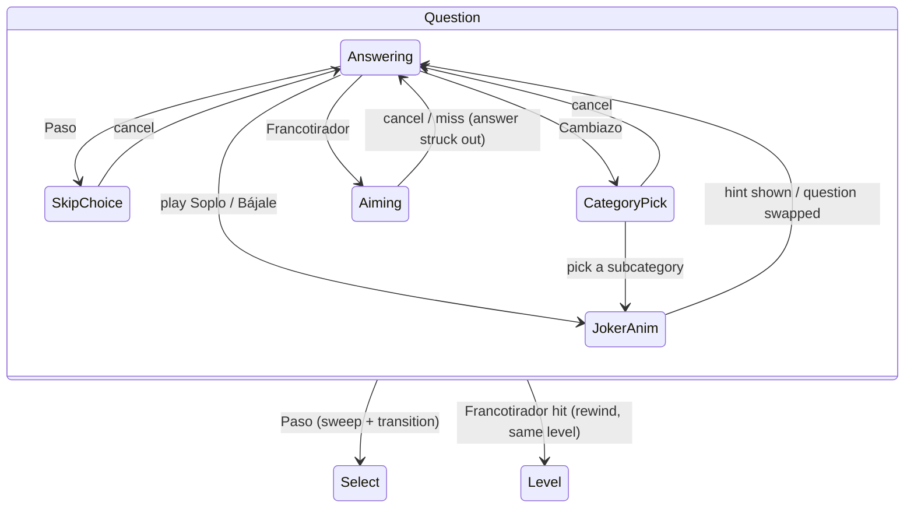

# 09 — Jokers (Comodines)

**Status:** draft

The players have **jokers**: powers they can play on the Question screen, **as often as they like** (D-27). This file owns the joker rules, their server side, their UI and their animations (D-26, D-27). The base rules and burning per player are in `03-game-flow.md` (D-28), the screens and the transition routine in `04-ui-tv-display.md`. UI copy is Spanish (D-6). Names and keys are fixed by D-30 (A–D stay reserved for the answers); the animations below are the plan.

"Category" in this file always means the question's **subcategory** (D-19, D-27).

## The five jokers

| Joker | Spanish name (D-30) | Key | Effect |
|---|---|---|---|
| Hint | «Soplo» | `S` | Reveals the next hint of the current question (vague → strong, D-7), until all three are shown. |
| Skip | «Paso» | `P` | Drops the current question; back to Select, where a new card replaces it. **Optional:** also purge the question's whole subcategory from the rest of the game. |
| Easier | «Bájale» | `F` | Swaps the current question for an **easier** one from the **same subcategory**. |
| Category | «Cambiazo» | `T` | Swaps the current question for one of **similar difficulty** from a **subcategory the players choose**. |
| Snipe | «Francotirador» | `X` | The players aim at one answer. **Wrong answer hit:** it is revealed as wrong (struck out), and play goes on with the remaining answers. **Right answer hit:** the question is lost, and the **current level repeats** with fresh questions (no game over, no other cost). |

## Rules

### Common
- Jokers are played only on the **Question screen**, while no answer is submitted (states Presenting/Answering/Locked in 04). They can't be played on Select, and not after «Respuesta final».
- Playing a joker while an answer is locked in **unlocks it first** (the reverse padlock animation, D-22), then the joker runs.
- **No limits (D-27):** every joker can be played any number of times per game and per question, in any combination. The only limits come from the question and the pool (see Availability).
- **The server is the referee (D-25):** it decides whether a joker is available, carries it out, and records it in the game state. The client never learns the correct answer or unrevealed hints from a joker.
- **Availability:** a joker that can't be carried out right now is shown **disabled**, with a short reason on focus («No quedan pistas», «No hay preguntas más fáciles de este tema»). For jokers that need a replacement question, the server checks that one exists **and** that the exact matching (GF-2) still fills every later level with 4 cards without it. A joker never makes the game fall back to fewer cards (D-22).
- **Burning (D-28):** every question the players have **seen** is burned **for this player**: skipped, swapped away (Bájale, Cambiazo), lost to a Snipe hit, or answered. Only the descriptions on cards that weren't picked stay unburned.
- **Undo (admin, GM-2):** restores the state before the last final answer. Jokers played before that answer stay played, and the questions they burned stay burned.
- Jokers played per question go into the history (B-1), so the session log can show where they helped.

### Soplo (hint)
- Each use shows the next of the question's three hints, from vague to strong. When all three are shown, Soplo is disabled for this question («No quedan pistas»).
- Hints shown stay visible until the question ends. A replacement question starts with no hints shown.
- Hints are only shown through this joker (D-26).

### Paso (skip), optionally purging the subcategory
- Playing it opens a small choice: «Paso» or «Paso, y fuera el tema "<subcategory>"» (and «Cancelar»). This is one of the few places where a category name is shown (D-8 normally hides it), because the players need to know what they purge.
- The skipped question is burned for the player. Back to Select, the skipped card is replaced by a new one from the level's range.
- **Purge:** the subcategory (D-19) is excluded from every later draw in this game. Any other card of that subcategory still on the table at this level is replaced too. The purge option is disabled if the remaining levels can't be filled without that subcategory.

### Bájale (easier)
- The new question is from the **same subcategory** and has a **strictly lower difficulty** than the current one. It may be below the level's range (that is the point). Draft preference: the highest difficulty below the current one, so each step is noticeable but not a giveaway; random among ties. Playing it again steps further down.
- Disabled when the subcategory has no easier question left for this player. Subcategories are small (D-19 has ~140), so this joker depends on pool growth (OQ-17).
- No trip back to Select: the new question replaces the old one in place (see Animations).

### Cambiazo (subcategory of choice)
- Opens a **two-step picker**: first the 24 broad categories, then the subcategories of the chosen one (D-19). The players end up choosing a subcategory. Subcategories without a fitting question are disabled, and broad categories with none left are disabled too. The current subcategory is disabled.
- "Similar difficulty": the new question's difficulty is in the **level's range** (GF-2), preferring the current question's difficulty, then ±1.
- The chosen subcategory is shown on screen; the question replaces the old one in place.
- «Atrás» goes from the subcategories back to the broad categories; «Cancelar» closes the picker without playing the joker.

### Francotirador (snipe)
- Playing it enters an **aiming mode**: the players choose a target answer (click, `A`–`D` / `1`–`4`, arrows to move the crosshair), then confirm the shot (click again or `Enter`). `Backspace` cancels. Answers already struck out can't be targeted.
- **Miss (target is a wrong answer):** that answer is struck out and disabled for the rest of the question. The players continue with the remaining answers, and may snipe again.
- **Hit (target is the correct answer):** the correct answer is shown, the question is burned, and the **level repeats**: back to the Level screen (no new block), then Select with **4 fresh cards** from the same range. The game is not lost, and nothing else is taken away; repeating the level is the punishment (D-27).
- Disabled when only one answer is left (it can only be the correct one), and when a hit would leave the level without 4 fresh cards.

## Game state and API (server)
Extends the state in `server/game.py` (GF-4):
```jsonc
  "purged": ["Volcanes"],         // subcategories excluded from later draws in this game
  "hints_shown": 1,               // for the current question, 0–3
  "struck": [2],                  // answer indexes struck out by Snipe misses
  "history": [{"level", "question_id", "correct", "jokers": ["snipe", "hint"]}]  // plus entries for skipped, swapped and sniped questions
```
- `POST /api/game/joker` with `{"joker": "hint"}`, `{"joker": "skip", "purge": true}`, `{"joker": "easier"}`, `{"joker": "category", "subcategory": "<name>"}`, `{"joker": "snipe", "index": 0-3}`. The answer tells the client what happened (`{"outcome": "miss" | "hit", ...}` for the snipe), plus the new game view.
- `GET /api/game` gains `jokers`: per joker `available` plus a reason, and for Cambiazo the subcategories (grouped by broad category) that are possible right now.
- The game view sends only the **hints shown** (today it sends all three).
- Every replaced question is burned for the game's player (D-28); `draw` and the matching skip `purged` subcategories.
- The supply check at game start ignores jokers. Jokers only use up spares, so a rich pool keeps them available longer (OQ-17).

## UI

### Joker tray
- Five **joker tokens** in a tray along one edge of the Question screen (draft: a vertical strip on the left, so the 2×2 answers and the question band keep their room). Tokens look like big poker chips or playing cards with an icon: light bulb (Soplo), door/arrow (Paso), down stairs (Bájale), compass/wheel (Cambiazo), crosshair (Francotirador). The key letter sits in a corner.
- States: **available** (bright, gentle idle shimmer) and **disabled right now** (dim, a small lock, reason on focus). Jokers never run out, so there is no "used up" state. Soplo shows three pips for the hints still hidden on this question.
- The tray is also shown, small and read-only, on the Level and Select screens, as a reminder.
- **Arming:** tapping a token (or its key) lifts it and shows «¿Usar Soplo?». A second tap or `Enter` plays it; `Backspace`, a tap elsewhere or a timeout of ~4 s puts it back. This guards against accidental taps from the couch, which matters because most jokers burn a question. Paso, Cambiazo and Francotirador go straight into their own dialog or mode instead, which has a cancel.

### Common play animation
Every joker starts the same way, then branches into its own effect:
1. The token flies out of the tray to the centre of the screen, grows and spins (~0.5 s), with a **joker "activate" shimmer** sound. The question music ducks to ~50 %.
2. The token bursts (sparkles) and its own effect starts.
3. Afterwards a fresh token pops back into its slot (Soplo loses a pip). The music returns.

Input is ignored while a joker animation runs, as with transitions. Durations live with the other constants (UI-6). The reduced-motion toggle shortens these to fades. Since jokers can be played many times, the common part is short (well under a second) so repeated use doesn't drag.

### Soplo
- The burst turns into a **sticky note** (or an envelope that unfolds) that slides into the reserved hint area under the question band (UI-2). The hint text types in letter by letter, with a light "ding" and a paper rustle.
- Later hints stack as further notes, slightly tilted, numbered «Soplo 1/2/3», getting more emphatic in colour (vague → strong).

### Paso
- Dialog with two big buttons; the purge button names the subcategory and shows a small stamp.
- **Skip only:** the question band and the answers are **swept off** to the side (a giant cartoon broom or a gust of wind), with a whoosh. Then the usual transition (04) into Select, where the replacement card deals in with the paper flick, slightly highlighted («¡Nueva!»).
- **Skip + purge:** before the sweep, the subcategory name appears big on screen and a red stamp «ELIMINADO» slams onto it (thump), then the name drops into a **paper shredder** (or burns up) with a shredder sound. At Select, every replaced card deals in with the highlight.

### Bájale
- The question and answers turn over like a **card flip** (3D, ~0.6 s) while a **descending slide whistle** plays. A small difficulty dial or staircase in the corner ticks down from the old difficulty to the new one. The background media crossfades to the new question's media during the flip. On the back side, the new question is already there; media autoplays as on a fresh Question screen.
- This is a transition inside the Question state, not a screen change: no fade to black, the `question` music keeps running (ducked), unless the new media is audio/video (then music goes off as in 04).

### Cambiazo
- The burst opens the **picker**: a grid of 24 broad-category tiles (name + icon, large enough for the TV), dealt in like cards, with disabled ones greyed. Picking a tile flips the grid over to that category's subcategories (smaller tiles, same style), with a paper flick. Navigation: click, arrow keys + `Enter`, `Backspace` = back.
- The chosen subcategory tile pulses (pop), zooms towards the question band and turns into the new question with the same **card flip** as Bájale, accompanied by a rising "swoosh" instead of the slide whistle. The subcategory name stays on screen as a small label for this question.

### Francotirador
- **Aiming mode:** the screen darkens slightly except the answers; a **scope vignette** (round mask) and a **crosshair** appear. The crosshair follows the mouse or jumps between answers with keys, with a soft "tick" on each move. A slow heartbeat replaces the ducked music. A hint line: «Elige la respuesta que crees que es falsa».
- **The shot:** confirm → a short zoom on the target, a beat of silence (~0.6 s, longer at higher levels), then the shot. Keep it cartoonish for 11- and 12-year-olds (D-6): a cork popgun, a suction-cup dart or a paintball splat rather than a realistic gun; sound to match (pop + "thwack").
- **Miss:** the answer **cracks and shatters** (glass shards fall and fade), leaving a struck-out, greyed slot with a red ✗; a satisfied "ding". The vignette opens, music returns.
- **Hit:** the target **glows green** (the correct answer is shown), a comic «¡Ups!» sound (record scratch or a sad trumpet "wah"), and a short caption «¡Le diste a la correcta! Este nivel se repite». Then a special **rewind transition** to the Level screen: the screen rewinds (a VHS-style rewind with a whirr) instead of fading to black. The tower stays as it is; no block drops; the Level screen says «Nivel N de 12 — otra vez». Then Select with 4 fresh cards.

## Screen flow (adds to the diagram in 04)

(Locked → any joker unlocks first, then follows the arrows from Answering.)

## Sound assets (add to the starter list in 04)
Joker activate shimmer; token pop-back; hint ding + paper; sweep whoosh; stamp thump; shredder; card flip; descending slide whistle; rising swoosh; category tile tick; heartbeat loop; scope tick; popgun/dart shot; glass shatter; «¡Ups!» sting; rewind whirr. Same licensing rules as all UI audio (D-22).

## Tasks
- [x] JK-1 Confirm the joker rules with the gamemaster. *2026-10-06: unlimited uses, one hint per Soplo, no extra cost for a Snipe hit, "category" = subcategory, seen questions burned per player (D-27, D-28). Names and keys: D-30 (the gamemaster left the names to us); animations as planned below.*
- [x] JK-2 Server: `POST /api/game/joker`, availability per joker (matching-aware, with reasons), purge in `draw`, burn replaced questions for the player, send only the hints shown, history entries. *2026-10-06: `server/game.py`. Availability runs each joker on a copy of the state inside a SQLite savepoint and rolls it back, so it can't disagree with the real play; Cambiazo checks every subcategory against one shared matching (~20 ms for the whole view). The response to a joker adds `event` (what happened, for the animation). History entries of replaced questions carry `outcome` instead of `correct`. Also fixed: undo restored a shallow copy, so the restored history still held the undone answer.*
- [x] JK-3 Server: Snipe (strike out, hit path: burn, redraw 4 cards for the same level). *2026-10-06: `play_snipe` in `server/game.py`; availability simulates a hit (needs 4 fresh cards) and at least two answers left; a hit sets `repeat` until the next pick («Nivel N de 12 — otra vez»); struck answers can't be the final answer. Client types for jokers in `client/src/lib/types.ts`.*
- [ ] JK-4 Client: joker tray (states, arming, keys, hint pips) on Question, read-only tray on Level and Select.
- [ ] JK-5 Client: common joker play animation (fly-out, burst, pop-back) and input lock.
- [ ] JK-6 Client: Soplo notes; Paso dialog, sweep, purge stamp and shredder; replacement-card highlight on Select.
- [ ] JK-7 Client: card-flip swap (Bájale, Cambiazo), difficulty dial, two-step subcategory picker.
- [ ] JK-8 Client: Francotirador aiming mode, shot, shatter (miss), hit sequence and rewind transition to Level.
- [ ] JK-9 Joker sounds (list above) via the audio engine (UI-8), with synthesized fallbacks until assets exist (UI-10).
- [ ] JK-10 `qgen.py report`: supply per subcategory and difficulty, so it's visible where Bájale and Cambiazo will run dry (OQ-17).
