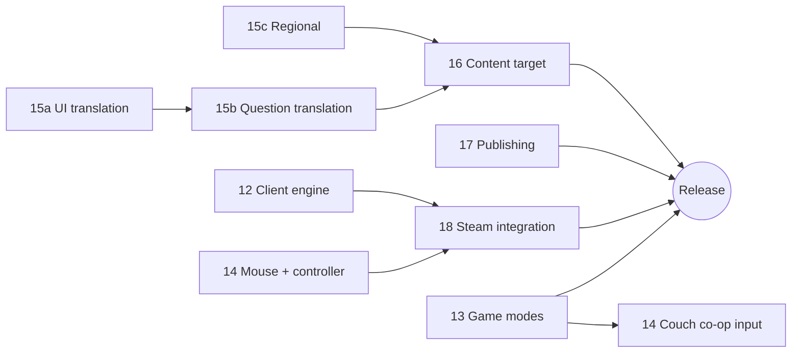

# 11 — Steam Release (Master Plan)

**Status:** draft

Turns «¡Trivia!» from a private living-room game (D-2) into a game anyone can buy and install from Steam (D-34). This file is only the map: the goal, the guiding principles, the tracks, their order and the questions that block them. Each track has its own sub-plan, which owns the details and the tasks.

## Goal
A family can install the game from Steam on Windows, Linux or the Steam Deck. They can play it offline in a language they speak, without a gamemaster who knows the code, with a mouse, keyboard or controller, and with enough questions for many evenings. The family version at home keeps working the whole way through.

## Principles
1. **The family game night comes first.** A change ships to the family only when it doesn't make their game worse. Changes that don't change how the game plays (the TypeScript port, mouse support, string extraction) can land right away.
2. **One codebase, several modes.** The current way of playing stays as a mode (the gamemaster mode, [13](13-game-modes.md)). The Steam default mode is added next to it and doesn't replace it.
3. **Offline, no accounts, no telemetry.** Steam distributes the game and syncs saves. The game itself never phones home (AGENTS.md).
4. **Authoring stays in Python.** `qgen.py`, `media.py`, the review tool and the stats pages are authoring tools and don't ship. Only the game moves to TypeScript ([12](12-client-engine.md)).
5. **Minimal dependencies.** Shipping adds a desktop shell and a Steamworks binding ([18](18-steam-integration.md)). Every other dependency needs a decision.

## Tracks

| # | Sub-plan | What it covers | Changes the family game? | Can start |
|---|----------|----------------|--------------------------|-----------|
| 12 | [Client engine](12-client-engine.md) | Move the game referee from Python (`server/game.py`, `tools/selection.py`) to TypeScript; storage adapters; pool export | No (same rules, same saves) | **now** |
| 13 | [Game modes](13-game-modes.md) | Gamemaster mode with joker counts you can set, a default mode with difficulty presets, a competitive mode for 8+ players (stub), small rule changes | Only if the family opts in | **now** (joker budget); later the rest |
| 14 | [Input](14-input.md) | Every button clickable, controller support, couch co-op input | No | **now** (mouse) |
| 15 | [Internationalization](15-i18n.md) | Locale model; sub-plans [15a UI](15a-ui-translation.md), [15b questions](15b-question-translation.md), [15c regional](15c-regional-questions.md) | No | **now** (15a string extraction) |
| 16 | [Content target](16-content-target.md) | How many questions a release needs, how that is measured, the quality bar | No (more questions help the family too) | after OQ-32 |
| 17 | [Publishing](17-publishing.md) | Media and code licenses, credits, AI disclosure, store page, Steamworks account, rating | Credits screen only | **now** (audit) |
| 18 | [Steam integration](18-steam-integration.md) | Desktop shell, Steamworks (overlay, Cloud, achievements), builds, depots, Steam Deck | No | after 12 |

## Phases

| Phase | Content | Tasks (start with) | Exit |
|-------|---------|--------------------|------|
| **S1 — Groundwork** (no impact on the family) | TS engine, all buttons clickable, UI strings in a catalog, joker budget with the default "unlimited", license audit | PORT-1..PORT-8, IN-1, LUI-1..LUI-3, MD-1..MD-4, PUB-1..PUB-3 | The family game runs on the TS engine. `python3 server/main.py` is only a static server plus the authoring API. |
| **S2 — Product definition** | Answer the open questions below. Define the default mode and the launch languages. | MD-5..MD-7, I18N-1, CT-1, PUB-4 | OQ-29..OQ-37 resolved in `decisions.md` |
| **S3 — Playable desktop build** | Electron shell, file saves, controller support, Deck layout, credits screen | SW-1..SW-6, IN-2..IN-5, PUB-5 | A local build runs on Windows, Linux and the Deck with a controller only |
| **S4 — Content for release** | Translated UI and questions, regional packs, reaching the content target | QT-*, RG-*, CT-* | `qgen.py report --simulate` meets the target for every launch language |
| **S5 — Steam** | Steamworks app, Cloud, achievements, depots, beta branch, store page, disclosures | SW-7..SW-14, PUB-6..PUB-11 | Beta branch installed from Steam on a second machine and played by the family |
| **S6 — Release** | Coming-soon page, wishlists, release, patches | ST-3..ST-5 | Released; content updates go out as patches |
| **Later** | Competitive mode (8+ players), couch co-op, more regions and languages | MD-8+, IN-6+ | — |

Phases S1 and S2 can run in parallel. S1 is pure engineering, S2 is decisions.

## Open questions (blocking)
All are logged in [`open-questions.md`](open-questions.md):

| ID | Question | Blocks |
|----|----------|--------|
| OQ-29 | Desktop shell: Electron (recommended), Tauri, or a browser + local server | 18 |
| OQ-30 | Default mode: joker counts per difficulty preset, and which levels count as "won" | 13 |
| OQ-31 | Launch languages (Spanish only? plus English?) and Spanish usage (Colombian vs. neutral) | 15, 16 |
| OQ-32 | Content target for launch: games per new player, per language | 16 |
| OQ-33 | Price model (paid, free, free + paid packs) and who holds the Steamworks account (person or company, tax) | 17 |
| OQ-34 | Store name: «¡Trivia!» is generic and hard to find in search | 17 |
| OQ-35 | Code and content license; does the question pool stay public on GitHub? | 17 |
| OQ-36 | Audience: kids and families only (D-6 scale: ages 6–16), or an adult track too | 13, 16 |
| OQ-37 | Competitive and couch co-op: hot-seat on one screen, one controller per player, or phones as buzzers | 13, 14 |

## Risks
- **Content volume and factual errors** are the most likely reason for bad reviews. A wrong answer in a public product costs more than at home. See 16 (quality bar) and 13 (a "report this question" action instead of the gamemaster's «Saltar y quemar para todos»).
- **Media licensing:** ~290 Commons files under nine license types. ShareAlike, PD-US-only and GFDL need care in a worldwide commercial release (17).
- **Install size:** the media cache is ~720 MB today and grows with the pool. It needs resizing and re-encoding before shipping (SW-9).
- **Engine port regressions:** the referee has subtle supply and matching rules. 12 builds fixtures from the Python engine before the port.
- **Scope creep:** competitive mode and couch co-op are explicitly "Later". The release doesn't wait for them.

## Tasks
- [ ] ST-1 Resolve OQ-29..OQ-37 and record each answer in `decisions.md` (phase S2).
- [x] ST-2 Add the new files to `README.md`, the Steam track to `project.md`, the questions to `open-questions.md` and D-34. *2026-10-07: done with this plan; keep `project.md` in sync from now on.*
- [ ] ST-3 Steam "Coming soon" page live (after PUB-8, SW-7).
- [ ] ST-4 Release checklist: build from a tagged commit, `qgen.py validate` clean, credits complete, offline test, Deck test, family sign-off.
- [ ] ST-5 Post-release: content update cadence, how question reports are collected (no telemetry, so by hand: a Steam discussions thread or an email link).
