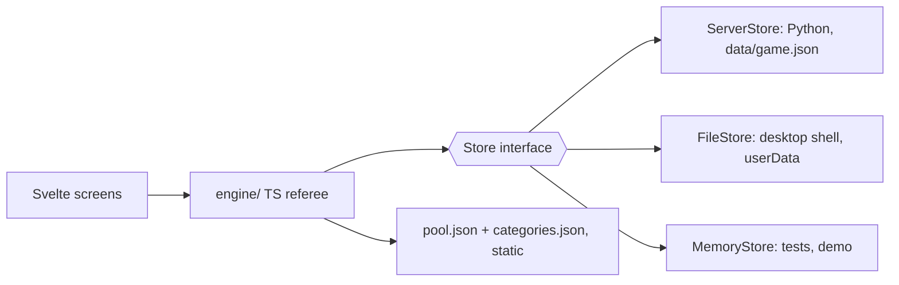

# 12 — Client Engine (Python → TypeScript)

**Status:** draft

Part of the Steam plan ([11](11-steam.md)), phase S1. It moves the game referee from the Python server into TypeScript, so the game runs without Python: in the browser, in a desktop shell ([18](18-steam-integration.md)), on the Steam Deck. **The rules don't change and the family's saves are kept.** This is a pure engineering change and can start now.

## Today
- `server/game.py` (~550 lines): players, games (the state as JSON), burning per player and for everyone, draw, pick, answer, skip, undo, jokers (D-25..D-28).
- `tools/selection.py` (~130 lines): supply check and draw via exact bipartite matching (GF-2).
- `tools/categories.py`: loads `data/categories.json`.
- `server/main.py`: the `/api/game/*` and `/api/players*` routes, and also the authoring API (review tool, stats, media).
- State: `data/game.sqlite` (players, games, burned).
- The server is the referee: the client never sees the correct answer or unrevealed hints before they are played (D-25).

## Target

- **`client/src/engine/`**: a pure TypeScript module with no DOM and no Svelte. It covers `selection.ts` (matching, supply), `game.ts` (state machine, jokers, burning, undo), `pool.ts` (loading and filtering), `rng.ts` (a seedable PRNG). Every function takes the state and returns the new state, so undo and saves stay simple.
- **Store interface**: `load(): SaveData` / `save(SaveData)`. `SaveData` is one versioned JSON document (`{version, players, games, burned}`) that replaces the SQLite tables. The data is small (players × burned IDs), so one document fits easily, and it suits Steam Cloud (one file) too.
- **`ServerStore`** (family mode, the default for now): the Python server keeps a tiny `GET/PUT /api/save` that writes `data/game.json` atomically. Python doesn't drop out of the family setup yet: D-3 rejected localStorage as fragile, and that reasoning still holds.
- **Pool export**: `qgen.py export` writes the playable pool (`approved` only, without `review`, `quality` and pipeline fields) to `client/public/pool/<locale>.json`, or the game loads `data/questions.json` and filters it. Export is preferred: smaller, and it is also the shipping format (15b).
- **Python server after the port**: static files plus the authoring API (review, stats, media fetch) plus `/api/save`. `server/game.py` and the game routes are deleted once parity holds.

## The referee question (needs a decision)
With the engine in the client, the correct answer is in memory before the players answer. For an offline single-player game that is acceptable: anyone who opens devtools to cheat at family trivia only spoils their own game. This relaxes D-25 ("the client never learns the correct answer"). The UI still must never *render* hidden data. Record it as a decision when PORT-3 lands.

## Parity strategy
1. **Fixtures first (PORT-1):** before porting, write a scenario recorder for the Python engine. It plays scripted games (picks, answers, every joker, skip, burn for everyone, undo, supply failures) on a small fixed pool and stores the inputs and outputs as JSON in `client/src/engine/fixtures/`. Randomness is made deterministic by injecting the shuffle choices into the recording.
2. **Port module by module:** `selection` first (pure, easy to compare), then `game`.
3. **Fixture tests:** the TS engine replays every fixture and must produce the same states. Tests use Node's built-in `node:test` (no new dependency).
4. **Invariant tests:** for random seeds on the real pool, check that every level gets 4 cards, burned questions never come back, and an available joker never breaks the supply.

## Migration
- `server/main.py` migrates `data/game.sqlite` to `data/game.json` once on start (players, burns per player and for everyone, the running game). The `.sqlite` file is kept as a backup.
- `SaveData.version` makes later migrations possible (game modes in 13, multiple locales in 15).

## Tasks
- [ ] PORT-1 Scenario recorder for `server/game.py` + `tools/selection.py`; commit the fixtures.
- [ ] PORT-2 `engine/selection.ts`: supply check and draw (GF-2, D-25), fixture-tested.
- [ ] PORT-3 `engine/game.ts`: state machine, players, burning, jokers, undo. Decision: the client holds the answer (relaxes D-25).
- [ ] PORT-4 Store interface; `ServerStore` + Python `GET/PUT /api/save` (atomic write, with a retry for Windows file locks); `MemoryStore` for tests.
- [ ] PORT-5 Migration `game.sqlite` → `game.json`, tested on a copy of the family's real save.
- [ ] PORT-6 `qgen.py export`: the playable pool for the client; `validate` checks that the export is current.
- [ ] PORT-7 Switch the screens from `lib/api.ts` game calls to the engine. Family test night on the TS engine.
- [ ] PORT-8 Delete `server/game.py` and the game routes; `tools/selection.py` stays only if `qgen.py report` still needs it (otherwise the report calls the TS engine via Node, or keeps its own copy, to be decided). Update `01-architecture.md` and AGENTS.md.
